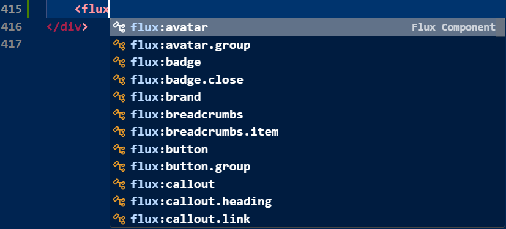

# Flux UI v2 - VS Code Extension


IntelliSense and autocomplete for [Flux UI](https://fluxui.dev) v2.x components in Laravel Blade files.



## Features

- **Component Autocomplete**: Type `<flux:` to see all available Flux components
- **Prop Suggestions**: Get intelligent prop completions inside component tags
- **Type Hints**: See prop types, defaults, and allowed values
- **Livewire Integration**: Common Livewire/Alpine attributes are suggested
- **Flux Pro Support**: Includes both free and Pro components (configurable)

## Installation

### From VS Code Marketplace

1. Open VS Code
2. Press `Ctrl+P` / `Cmd+P`
3. Type `ext install d3v0psdan.flux-ui-v2`

### From VSIX

1. Download the `.vsix` file from [Releases](https://github.com/d3v0psdan/flux-ui-v2-extension/releases)
2. In VS Code, open Command Palette (`Ctrl+Shift+P` / `Cmd+Shift+P`)
3. Run "Extensions: Install from VSIX..."
4. Select the downloaded file

## Usage

### Component Suggestions

Type `<` or `<flux:` in a `.blade.php` file to see component suggestions:

```blade
<flux:button variant="primary">
    Click me
</flux:button>

<flux:input name="email" placeholder="Enter email" />

<flux:modal name="confirm-delete">
    <flux:heading>Delete Item?</flux:heading>
    <flux:text>This action cannot be undone.</flux:text>
</flux:modal>
```

### Prop Suggestions

Inside a component tag, press `Space` to see available props:

```blade
<flux:select
    name="country"
    placeholder="Select country"
    searchable
    clearable
>
    <flux:select.option value="us">United States</flux:select.option>
    <flux:select.option value="uk">United Kingdom</flux:select.option>
</flux:select>
```

## Supported Components

This extension supports all 44+ Flux UI v2 components:

| Component | Description |
|-----------|-------------|
| `accordion` | Collapsible content sections |
| `autocomplete` | Searchable input with suggestions |
| `avatar` | User avatar display |
| `badge` | Status labels and counts |
| `breadcrumbs` | Navigation breadcrumb trail |
| `button` | Interactive buttons |
| `calendar` | Date selection calendar |
| `callout` | Highlighted message boxes |
| `card` | Container cards |
| `chart` | Interactive charts (Pro) |
| `checkbox` | Checkbox inputs |
| `command` | Command palette |
| `composer` | Chat message composer (New in v2) |
| `context` | Right-click context menus |
| `date-picker` | Date picker input |
| `dropdown` | Dropdown menus |
| `editor` | Rich text editor (Pro) |
| `field` | Form field wrapper |
| `file-upload` | File upload input |
| `heading` | Typography headings |
| `icon` | Heroicons display |
| `input` | Text inputs |
| `kanban` | Kanban boards (Pro, New in v2) |
| `modal` | Modal dialogs |
| `navbar` | Navigation bars |
| `otp-input` | OTP code input (New in v2) |
| `pagination` | Page navigation |
| `pillbox` | Tag/pill input (New in v2) |
| `popover` | Popover overlays |
| `profile` | User profile display |
| `radio` | Radio inputs |
| `select` | Select dropdowns (New in v2) |
| `separator` | Visual dividers |
| `skeleton` | Loading placeholders (New in v2) |
| `slider` | Range sliders (New in v2) |
| `switch` | Toggle switches |
| `table` | Data tables |
| `tabs` | Tabbed navigation |
| `text` | Typography text |
| `textarea` | Multi-line text input |
| `time-picker` | Time selection input |
| `toast` | Toast notifications |
| `tooltip` | Tooltip overlays |

## Configuration

Configure the extension in VS Code settings:

```json
{
    "flux-ui.enable": true,
    "flux-ui.includeProComponents": true
}
```

| Setting | Default | Description |
|---------|---------|-------------|
| `flux-ui.enable` | `true` | Enable/disable Flux UI suggestions |
| `flux-ui.includeProComponents` | `true` | Include Flux Pro components in suggestions |

## Updating Component Data

### Method 1: From Flux Source Files

To update from your local Flux installation:

```bash
node src/get-components.js /path/to/vendor/livewire/flux/resources/views/flux
```

### Method 2: From Documentation (Recommended)

Use the Claude Chrome extension to extract component data from fluxui.dev:

1. Visit each component page at `https://fluxui.dev/components/[name]`
2. Use Claude to extract the data with this prompt:

```
Extract all component data from this Flux UI documentation page and output as markdown:

## [Component Name]

**Description:** [description]
**Pro:** [Yes/No]
**Self-closing:** [Yes/No]

### Props

| Prop | Type | Default | Description |
|------|------|---------|-------------|

### Nested Components

#### flux:[nested.component]

| Prop | Type | Default | Description |
|------|------|---------|-------------|
```

3. Save the markdown output to `scripts/docs/[component].md`
4. Run the parser:

```bash
node scripts/parse-markdown-docs.js ./scripts/docs/
```

This will merge the extracted data into `src/components.json`.

## Requirements

- VS Code 1.86.0 or higher
- Works best with the [Laravel Blade Snippets](https://marketplace.visualstudio.com/items?itemName=onecentlin.laravel-blade) extension for proper Blade syntax highlighting

## Related

- [Flux UI](https://fluxui.dev) - The beautiful UI component library for Livewire
- [Livewire](https://livewire.laravel.com) - Full-stack framework for Laravel
- [Original Flux UI Extension](https://github.com/joshhanley/flux-ui-extension) - Inspiration for this extension

## Contributing

Contributions are welcome! Please feel free to submit a Pull Request.

## License

MIT License - see [LICENSE](LICENSE) for details.
